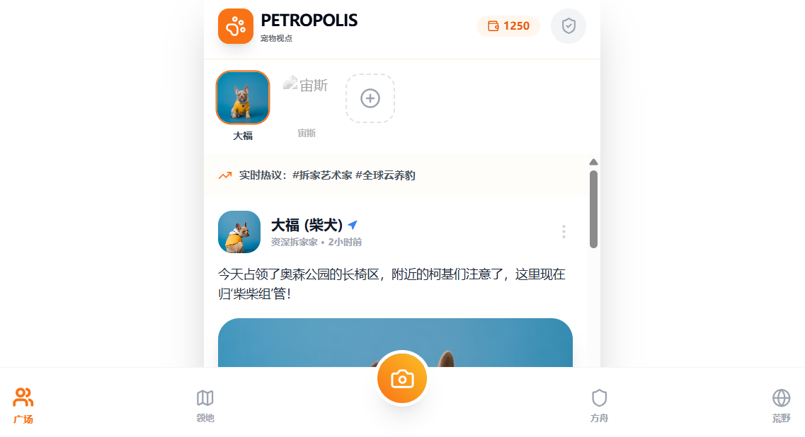
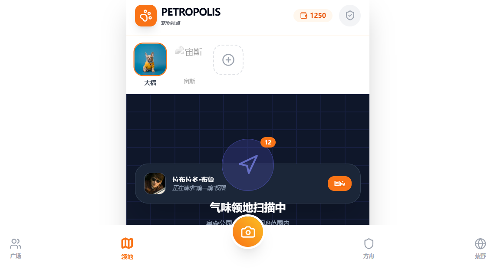
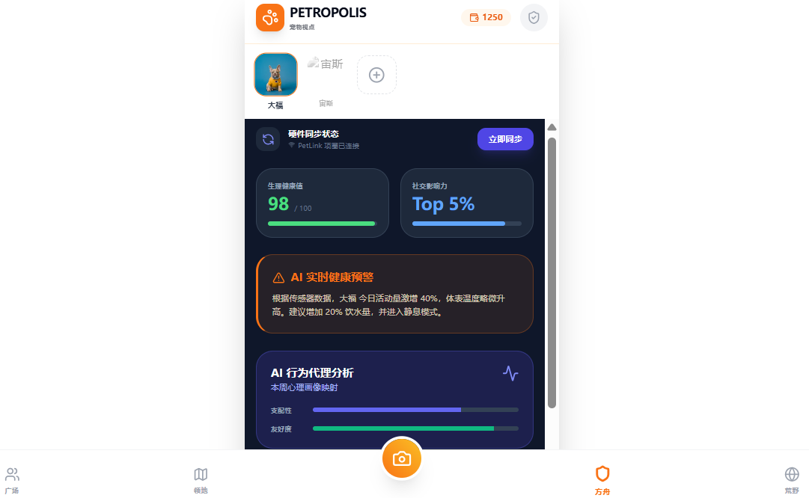
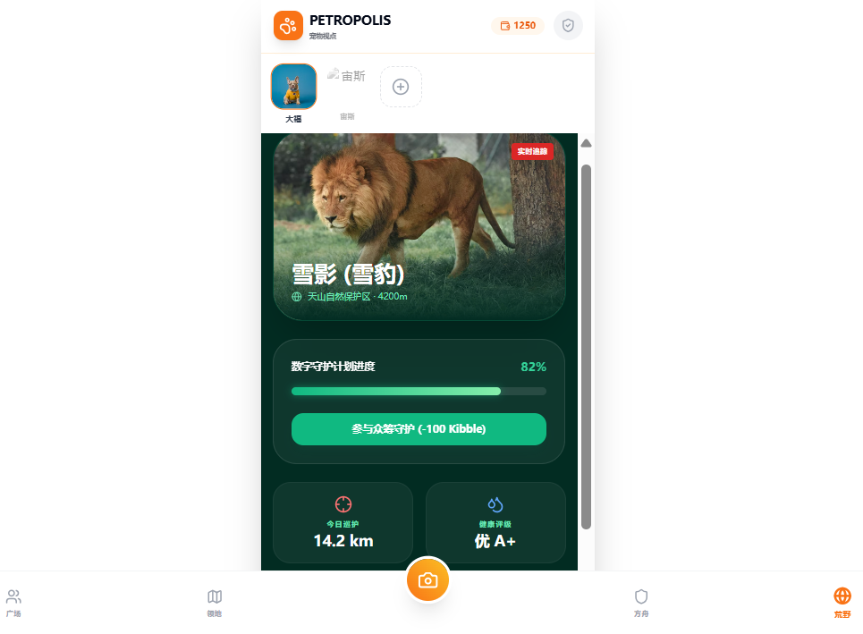

**Petropolis is a disruptive parallel social platform centered around pets. It defines the human role as a "behind-the-scenes agent" and builds a global life community that combines technological sophistication with emotional warmth and transcends species boundaries by deeply integrating AI health management, geofencing-based social networking, a closed-loop medical system covering the entire life cycle, and a "digital ark" public welfare system that connects the global wilderness.**

